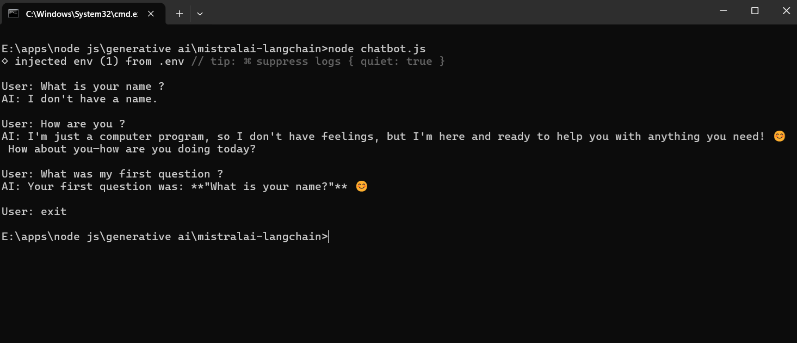

# LangChain Mistral AI Integration

This repository demonstrates how to integrate and use the `@langchain/mistralai` package in a Node.js environment to interact with Mistral AI language models for both standard generation and real-time streaming.

## Chatbot

